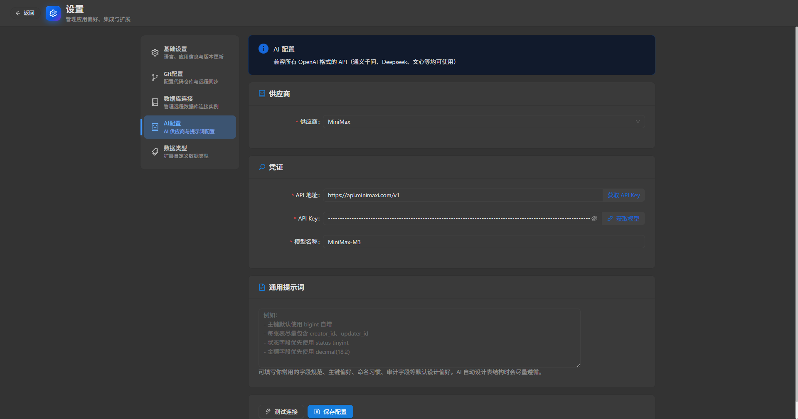
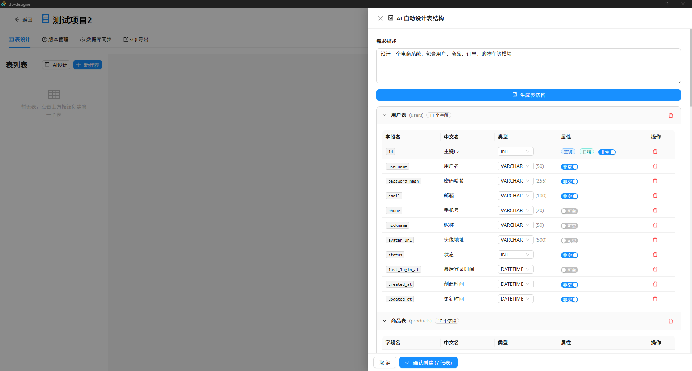
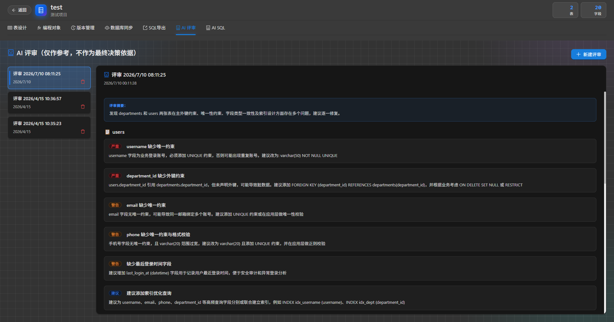
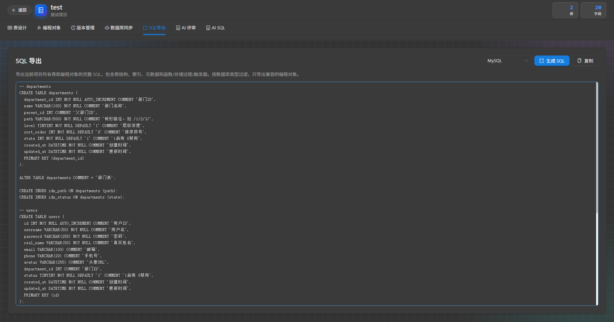
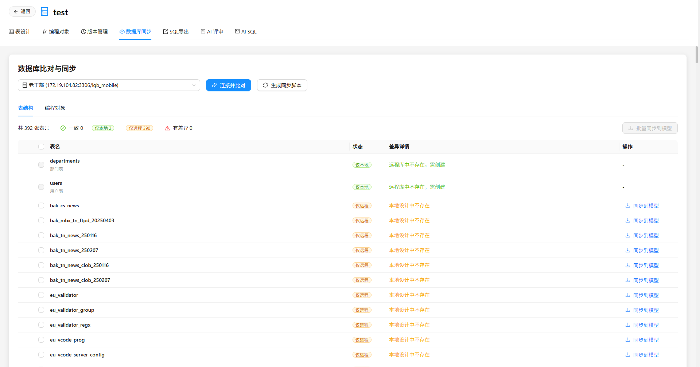

<div align="center">

# DB Designer

**AI 驱动的数据库模型设计工具**

自然语言建表 / AI 索引优化 / AI 表结构重构 / 多数据库适配 / 版本管理 / 结构同步

[English](README.md) | [简体中文](#)

[](https://github.com/dddcp/db-designer/releases)
[](https://github.com/dddcp/db-designer?tab=MIT-1-ov-file#readme)
[](https://github.com/dddcp/db-designer/releases)

</div>

---

## AI 能力

DB Designer 深度集成 AI 大模型，覆盖数据库设计的核心环节：

| 能力 | 说明 |
|------|------|
| **自然语言建表** | 用一句话描述业务需求，AI 自动生成完整的表结构、字段、类型与约束 |
| **项目上下文感知** | AI 设计新表时自动注入已有表结构、索引、元数据，理解业务全貌后再设计，确保命名风格一致、关联关系合理 |
| **AI 表结构重构** | 选中任意表，用自然语言描述修改意图，AI 生成调整后的完整结构 |
| **AI 设计偏好复用** | 可在设置页保存长期复用的 AI 设计通用提示词（如主键类型、命名习惯、审计字段），后续生成表结构时自动注入并尽量遵循 |
| **AI 索引推荐** | 提供慢查询 SQL 或业务特征（数据量、读写比、性能痛点），AI 分析后推荐最优索引方案，支持一键创建 |

> 兼容所有 OpenAI API 格式的模型服务（OpenAI / DeepSeek / 通义千问 / 本地 Ollama 等），在设置页面配置即可。

## 功能特性

| 功能 | 说明 |
|------|------|
| 表结构设计 | 可视化设计表、列、索引，支持拖拽排序 |
| 元数据管理 | 为表配置元数据，支持 Excel 导入与 INSERT 语句导出 |
| 版本管理 | 对项目结构打快照，支持版本间差异对比和 SQL 导出 |
| 数据库比对 | 连接远程 MySQL / PostgreSQL / Oracle，对比本地设计与线上结构差异 |
| 数据库同步 | 对比线上，生成增量脚本；支持一键同步线上表结构与编程对象到模型库 |
| 编程对象管理 | 支持函数、存储过程、触发器的增删改查、远程对比、一键同步与 SQL 导出 |
| SQL 导出 | 一键导出完整 SQL（表结构 + 索引 + 元数据 + 编程对象），支持 MySQL / PostgreSQL / Oracle |
| Git 数据同步 | 通过 Git 管理设计数据，支持推送与从远程拉取覆盖本地（危险操作带确认提示） |
| 本地配置与存储 | 基于 SQLite 本地存储，无需联网、无需服务端 |

## 截图预览

### AI 设计表结构

<p align="center">
  
</p>
<p align="center">
  
</p>
<p align="center">
  
</p>

### SQL 导出

<p align="center">
  
</p>

### 编程对象管理与同步

支持函数、存储过程、触发器的统一管理，可按数据库类型筛选导出与同步，适用于数据库对象较多的项目。

### 数据库对比与同步

<p align="center">
  
</p>

## 安装

前往 [Releases](https://github.com/dddcp/db-designer/releases) 下载对应平台安装包：

| 平台 | 格式 |
|------|------|
| Windows | `.msi` / `.exe` |
| macOS | `.dmg` |
| Linux | `.deb` / `.AppImage` |

## 本地开发

### 前置要求

- [Node.js](https://nodejs.org/) >= 18
- [Rust](https://www.rust-lang.org/tools/install) >= 1.70
- [Yarn](https://yarnpkg.com/)

### 启动开发环境

```bash
# 安装前端依赖
yarn install

# 启动开发模式
yarn tauri dev
```

### 构建生产包

```bash
yarn tauri build
```

## 技术栈

| 层 | 技术 |
|----|------|
| 框架 | [Tauri 2](https://tauri.app/) |
| 前端 | React 18 + TypeScript + Ant Design 5 |
| 后端 | Rust + SQLite (rusqlite) |
| 数据库连接 | mysql / postgres / Oracle 相关适配 |
| 构建工具 | Vite |

## 更新日志

查看 [CHANGELOG.md](./CHANGELOG.md)。
